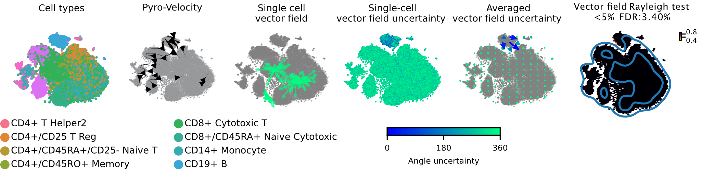
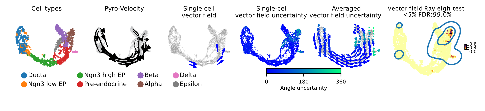
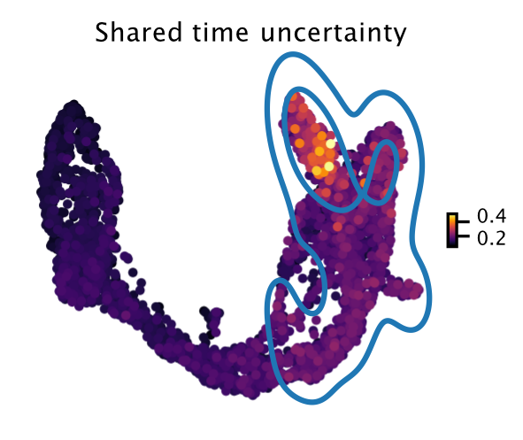
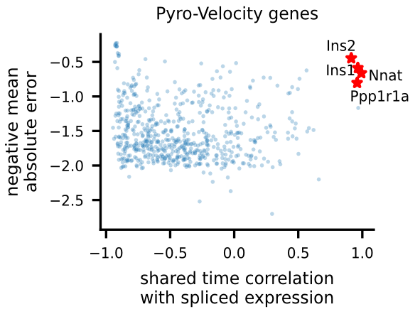
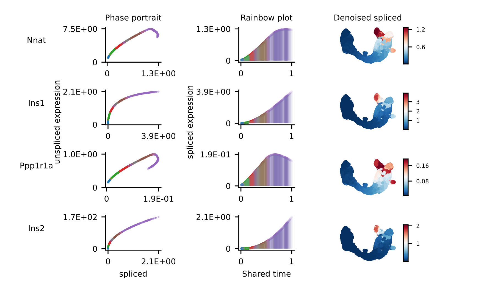
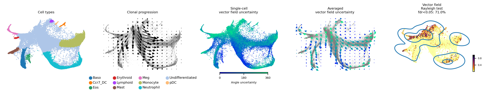
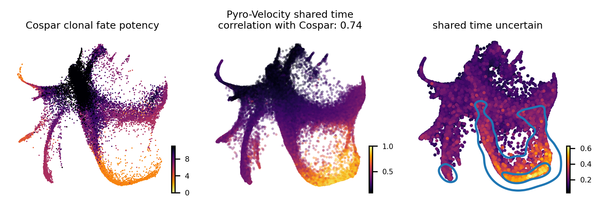

# Introduction

Pyro-Velocity is a Bayesian, generative and multivariate RNA Velocity
model to estimate the _uncertainty_ of cell future states. This approach
models _raw sequencing counts_ with the _synchronized cell time_ across
all expressed genes to provide quantifiable and improved information on
cell fate choices and developmental trajectory dynamics.

- LICENSE - Free software: Affero GPL V3

## Features

- Probabilistic modeling of RNA velocity
- Direct modeling of raw spliced and unspliced read count
- Multiple uncertainty diagnostics analysis and visualizations
- Synchronized cell time estimation across genes
- Multivariate denoised gene expression and velocity prediction


## Installation with miniconda

Please install miniconda following the instructions here: <https://docs.conda.io/en/latest/miniconda.html>, this step takes about 1-2 mins.

``` bash 
wget -c https://repo.anaconda.com/miniconda/Miniconda3-latest-Linux-x86_64.sh
bash Miniconda3-latest-Linux-x86_64.sh
# then follow the instruction to setup the conda base environment
```

After the conda has been setup, logout and re-login to install *mamba* to speed up installation, this step takes about 20s.

``` bash
conda install -c conda-forge mamba
```

Then add the channels, this step takes 1~2s.

``` bash
conda config --add channels defaults
conda config --add channels bioconda
conda config --add channels conda-forge
conda config --set channel_priority flexible
```

``` python
After that, install the _pyrovelocity_ package in one mamba command:

```bash
mamba create -n pyrovelocity_bioconda -c bioconda pyrovelocity
```

This step takes about 6-8 minutes depending on the network speed. If you prefer to use conda environment configurations, see the `conda` subfolder for installation with *prefix* to specify the installation path, such as:

```
# GPU
mamba env create --prefix /path_to_conda_env/qq-pyrovelocity-dev -f conda/environment-gpu.yml
# or CPU
mamba env create --prefix /path_to_conda_env/qq-pyrovelocity-dev -f conda/environment-cpu.yml
```

Or with more control of installing the environment,

``` bash
conda create -n pyrovelocity_bioconda python=3.8.8
mamba install -n pyrovelocity_bioconda -c bioconda pyrovelocity
# CPU
mamba env update -n pyrovelocity_bioconda -f conda/environment-cpu.yml
# or GPU
mamba env update -n pyrovelocity_bioconda -f conda/environment-gpu.yml
```

For windows user installation, please refer to the [issue](https://github.com/pinellolab/pyrovelocity/issues/9).

For gcp users, please refer to the setup [tutorial](https://github.com/pinellolab/pyrovelocity/tree/master/reproducibility/environment).


Lastly, test the installation by:

``` bash
conda activate pyrovelocity_bioconda
python
```

``` python
import pyrovelocity
```

## Additional packages necessary to reproduce all the analyses presented in the notebooks

``` bash
pip install cospar==0.1.9
```

## Quick start

After the installation, let\'s look at your dataset to see how
Pyro-Velocity can help understand cell dynamics.

Starting from raw sequencing FASTQ files, obtained for example with
SMART-seq, 10X genomics, inDrop or other similar single-cell assays, you
can preprocess the data to generate spliced and unspliced gene count
tables in h5ad file (or loom file using cellranger+velocyto or the
kallisto pipeline.

Starting from these count tables we show below a minimal step-by-step
workflow to illustrate the main features of Pyro-Velocity in a Jupyter
Notebook:

Step 1. Load your data, load your data(e.g. _local_file.h5ad_) with
scvelo by using:

``` python
import scvelo as scv
adata = scv.read("local_file.h5ad")
```

Step 2. Minimally preprocess your _adata_ object:

``` python
adata.layers['raw_spliced']   = adata.layers['spliced']
adata.layers['raw_unspliced'] = adata.layers['unspliced']
adata.obs['u_lib_size_raw'] = adata.layers['raw_unspliced'].toarray().sum(-1)
adata.obs['s_lib_size_raw'] = adata.layers['raw_spliced'].toarray().sum(-1)
scv.pp.filter_and_normalize(adata, min_shared_counts=30, n_top_genes=2000)
scv.pp.moments(adata, n_pcs=30, n_neighbors=30)
```

Step 3. Train the Pyro-Velocity model:

``` python
from pyrovelocity.api import train_model
# Model 1
num_epochs = 1000 # large data
# num_epochs = 4000 # small data
adata_model_pos = train_model(adata,
                               max_epochs=num_epochs, svi_train=True, log_every=100,
                               patient_init=45,
                               batch_size=4000, use_gpu=0, cell_state='state_info',
                               include_prior=True,
                               offset=False,
                               library_size=True,
                               patient_improve=1e-3,
                               model_type='auto',
                               guide_type='auto_t0_constraint',
                               train_size=1.0)

# Or Model 2
adata_model_pos = train_model(adata,
                               max_epochs=num_epochs, svi_train=True, log_every=100,
                               patient_init=45,
                               batch_size=4000, use_gpu=0, cell_state='state_info',
                               include_prior=True,
                               offset=True,
                               library_size=True,
                               patient_improve=1e-3,
                               model_type='auto',
                               guide_type='auto',
                               train_size=1.0)

# adata_model_pos is a returned list in which 0th element is the trained model,
# the 1st element is the posterior samples of all random variables
save_res = True
if save_res:
    adata_model_pos[0].save('saved_model', overwrite=True)
    result_dict = {"adata_model_pos": adata_model_pos[1],
                   "v_map_all": v_map_all,
                   "embeds_radian": embeds_radian, "fdri": fdri, "embed_mean": embed_mean}
    import pickle
    with open("model_posterior_samples.pkl", "wb") as f:
         pickle.dump(result_dict, f)
```

Step 4: Generate Pyro-Velocity's vector field and shared time plots
with uncertainty estimation.

``` python
from pyrovelocity.plot import plot_state_uncertainty
from pyrovelocity.plot import plot_posterior_time, plot_gene_ranking,\
      vector_field_uncertainty, plot_vector_field_uncertain,\
      plot_mean_vector_field, project_grid_points,rainbowplot,denoised_umap,\
      us_rainbowplot, plot_arrow_examples

embedding = 'emb' # change to umap or tsne based on your embedding method

# This generates the posterior samples of all vector fields
# and statistical testing results from Rayleigh test
v_map_all, embeds_radian, fdri = vector_field_uncertainty(adata, adata_model_pos[1],
                                                          basis=embedding, denoised=False, n_jobs=30)
fig, ax = plt.subplots()
# This returns the posterior mean of the vector field
embed_mean = plot_mean_vector_field(adata_model_pos[1], adata, ax=ax, n_jobs=30, basis=embedding)
# This plot single-cell level vector field uncertainty
# and averaged cell vector field uncertainty on the grid points
# based on angular standard deviation
fig, ax = plt.subplots(1, 2)
fig.set_size_inches(11.5, 5)
plot_vector_field_uncertain(adata, embed_mean, embeds_radian,
                            ax=ax,
                            fig=fig, cbar=False, basis=embedding, scale=None)

# This generates shared time uncertainty plot with contour lines
fig, ax = plt.subplots(1, 3)
fig.set_size_inches(12, 2.8)
adata.obs['shared_time_uncertain'] = adata_model_pos[1]['cell_time'].std(0).flatten()
ax_cb = scv.pl.scatter(adata, c='shared_time_uncertain', ax=ax[0], show=False, cmap='inferno', fontsize=7, s=20, colorbar=True, basis=embedding)
select = adata.obs['shared_time_uncertain'] > np.quantile(adata.obs['shared_time_uncertain'], 0.9)
sns.kdeplot(adata.obsm[f'X_{embedding}'][:, 0][select],
            adata.obsm[f'X_{embedding}'][:, 1][select],
            ax=ax[0], levels=3, fill=False)

# This generates vector field uncertainty based on Rayleigh test.
adata.obs.loc[:, 'vector_field_rayleigh_test'] = fdri
im = ax[1].scatter(adata.obsm[f'X_{basis}'][:, 0],
                   adata.obsm[f'X_{basis}'][:, 1], s=3, alpha=0.9,
                   c=adata.obs['vector_field_rayleigh_test'], cmap='inferno_r',
                   linewidth=0)
set_colorbar(im, ax[1], labelsize=5, fig=fig, position='right')
select = adata.obs['vector_field_rayleigh_test'] > np.quantile(adata.obs['vector_field_rayleigh_test'], 0.95)
sns.kdeplot(adata.obsm[f'X_{embedding}'][:, 0][select],
            adata.obsm[f'X_{embedding}'][:, 1][select], ax=ax[1], levels=3, fill=False)
ax[1].axis('off')
ax[1].set_title("vector field\nrayleigh test\nfdr<0.05: %s%%" % (round((fdri < 0.05).sum()/fdri.shape[0], 2)*100), fontsize=7)
```

Step 5: Prioritize putative cell fate marker genes based on negative
mean absolute errors and pearson correlation between denoised spliced
expression and posterior mean shared time, and then visualize the top
one with rainbow plots

``` python
fig = plt.figure(figsize=(7.07, 4.5))
subfig = fig.subfigures(1, 2, wspace=0.0, hspace=0, width_ratios=[1.6, 4])
ax = fig.subplots(1)
# This generates the selected cell fate markers and output in DataFrame
volcano_data, _ = plot_gene_ranking([adata_model_pos[1]], [adata], ax=ax,
                                     time_correlation_with='st', assemble=True)
# This generates the rainbow plots for the selected markers.
_ = rainbowplot(volcano_data, adata, adata_model_pos[1],
                subfig[1], data=['st', 'ut'], num_genes=4)
```

## Illustrative examples of Pyro-Velocity analyses on different single-cell datasets

### Pyro-Velocity on the PBMC dataset \[[1](https://scvelo.readthedocs.io/perspectives/Perspectives/)\]

This is a scRNA-seq dataset of fully mature peripheral blood mononuclear
cells (PBMC) generated using the 10X genomics kit and containing 65,877
cells with 11 fully differentiated immune cell types. This dataset
doesn\'t contain stem and progenitor cells or other signature of and
undergoing dynamical differentiation, thus no consistent velocity flow
should be detected.

Below we show the main output generated by Pyro-Velocity Model 1
analysis. Pyro-Velocity failed to detect high-confidence trajectories in
the mature blood cell states, consistent with what is known about the
biology underlying these cells.

**Vector Field with uncertainty**



These 6 plots from left to right show: 1. cell types, 2. stream plot of
Pyro-velocity vector field based on the posterior mean of 30 posterior
samples, 3. single cell vector field examples showing all 30 posterior
samples as vectors for 3 arbitrarily selected cells; 4. single cell
vector field with uncertainty based on angular standard deviation across
30 posterior samples, 5. averaged vector field uncertainty from 4. 6.
Rayleigh test of posterior samples vector field, the title shows the
expected false discovery rate using a 5% threshold.

The full example can be reproduced using the
[PBMC](https://github.com/pinellolab/pyrovelocity/blob/master/docs/source/notebooks/pbmc.ipynb)
Jupyter notebook.

### Pyro-Velocity on the Pancreas dataset \[[2](https://scvelo.readthedocs.io/VelocityBasics/)\]

Here we apply Pyro-Velocity to a single cell RNA-seq dataset of mouse
pancreas in the E15.5 embryo developmental stage. This dataset was
generated using the 10X genomics kit and contains 3,696 cells with 8
cell types including progenitor cells, intermediate and terminal cell
states.

Below we show the main output generated by Pyro-Velocity Model 1
analysis. Pyro-Velocity was able to define well-known developmental cell
hierarchies identifying cell trajectories originating from ductal
progenitor cells and culminated in the production of mature Alpha, Beta,
Delta, and Epsilon cells.

**Vector Field with uncertainty**



These 6 plots from left to right are showing the same analyses presented
as in the example above.

**Shared time with uncertainty**



The left figure shows the average of 30 posterior samples for the cell
shared time, the title of the figure shows the Spearman\'s correlation
with the Cytotrace score, an orthogonal state-of-the-art method used to
predict cell differentiation based on the number of expressed genes per
cell (Gulati et. al, Science 2020). The right figure shows the standard
deviation across posterior samples of shared time.

**Gene selection and visualization**

To uncover potential cell fate determinant markers genes of the mouse
pancreas, we first select the top 300 genes with the best velocity model
fit (we use negative mean absolute error ), then we rank the filtered
genes using Pearson\'s correlation between denoised spliced expression
and the posterior mean of the recovered shared time across cells.



For the selected genes, it is possible to explore in depth their
dynamic, using phase portraits, rainbow plots, and UMAP rendering of
denoised splicing gene expression across cells.

{width="1000px"}

The full example can be reproduced using the
[Pancreas](https://github.com/pinellolab/pyrovelocity/blob/master/docs/source/notebooks/pancreas.ipynb)
jupyter notebook.

### Pyro-Velocity on the Larry dataset \[[3](https://figshare.com/articles/dataset/larry_invitro_adata_sub_raw_h5ad/20780344)\]

This last example, present the analysis of a recent scRNA-seq dataset
profiling mouse hematopoises at high resolution thanks to lineage
relationship information captured by the Lineage And RNA RecoverY
(LARRY) system. LARRY leverages unique lentiviral barcodes that enables
to clonally trace cell fates over time (Weinrab et al. Cell 20).

Below we show the main output generated by Pyro-Velocity analysis.

**Vector Field with uncertainty**



These 5 plots from left to right shows: 1) Cell types, 2) Clone
progression vector field by using centroid of cells belonging to the
same barcode for generating directed connection between consecutive
physical times, 3) single cell vector field with uncertainty based on
angular standard deviation across 30 posterior samples, 4. averaged
vector field uncertainty from 3. 5. Rayleigh test of posterior samples
vector field, the title shows the false discovery rate using threshold
5%.

**Shared time with uncertainty**

To quantitatively assess the quality of the the receovered shared time
we also considered the agreement of our method with Cospar, a
state-of-the-art method specifically designed for predicting fate
potency based on LARRY data.



The leftmost figure shows the Cospar fate potency score, the middle
figure shows the average of 30 posterior samples from Pyro-Velocity
shared time per cell, the title of the figure shows the Spearman's
correlation between cell latent shared time and fate potency scores
derived from Cospar, the right figure shows the standard deviation
across posterior samples of shared time.

The full example can be reproduced using the
[LARRY](https://github.com/pinellolab/pyrovelocity/blob/master/docs/source/notebooks/larry.ipynb)
jupyter notebook.
