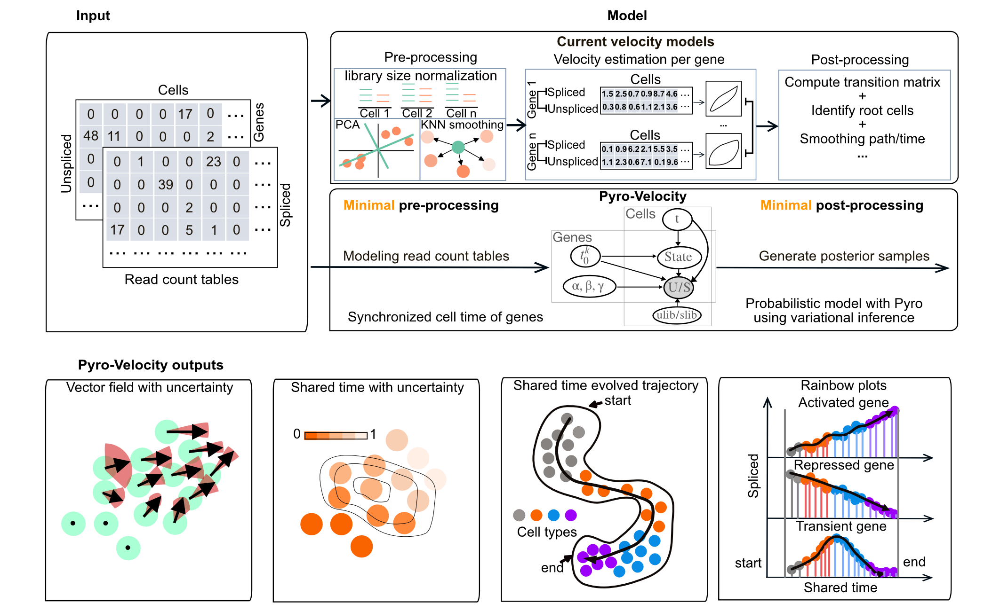

# Documentation

Pyro-Velocity is a Bayesian, generative and multivariate RNA Velocity
model to estimate the *uncertainty* of cell future states. This approach
models *raw sequencing counts* with the *synchronized cell time* across
all expressed genes to provide quantifiable and improved information on
cell fate choices and developmental trajectory dynamics.

## Features

-   Probabilistic modeling of RNA velocity
-   Direct modeling of raw spliced and unspliced read count
-   Multiple uncertainty diagnostics analysis and visualizations
-   Synchronized cell time estimation across genes
-   Multivariate denoised gene expression and velocity prediction




```{toctree}
---
hidden: true
maxdepth: 3
titlesonly: true
---

readme.md
installation.md
usage.md
source/notebooks/pancreas.ipynb
source/notebooks/pbmc.ipynb
source/notebooks/larry.ipynb
modules.md
contributing.md
authors.md
history.md
GitHub <https://github.com/pinellolab/pyrovelocity>
```

# Indices and tables

- {ref}`genindex`
- {ref}`modindex`
- {ref}`search`
